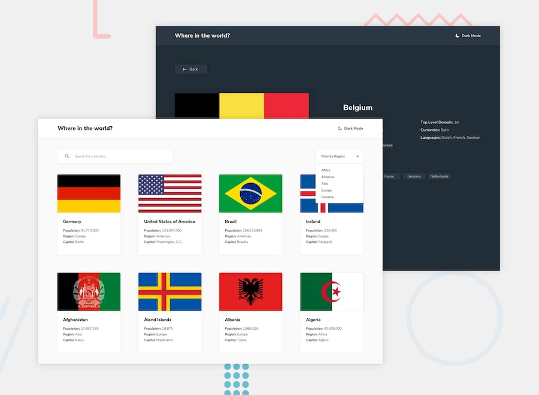

# REST Countries Website

## About  
Implementation of challenge from Front End Mentor.   
[REST Countries API with color theme switcher](https://www.frontendmentor.io/challenges/rest-countries-api-with-color-theme-switcher-5cacc469fec04111f7b848ca)

## Table of contents

- [Overview](#overview)
  - [The challenge](#the-challenge)
  - [Screenshot](#screenshot)
  - [Links](#links)
- [My process](#my-process)
  - [Built with](#built-with)
- [Author](#author)

## Overview

### The challenge
Challenge is to integrate with the REST Countries V2 API to pull country data and display it like in the designs.  

Users should be able to:
- See all countries from the API on the homepage  
- Search for a country using an input field  
- Filter countries by region  
- Click on a country to see more detailed information on a separate page  
- Click through to the border countries on the detail page  
- Toggle the color scheme between light and dark mode  

### Screenshot

### Links

- Live Site URL: [https://antcodev.ca/p-restcountry](https://antcodev.ca/p-restcountry)

## My process

### Built with
- Semantic HTML5 markup
- CSS custom properties
- Flexbox
- CSS Grid
- Typescript
- Axios
- [React](https://reactjs.org/) - JS library
- [Redux](https://redux.js.org/) - JS library  

## Author

- [My Portfolio](https://antcodev.ca)